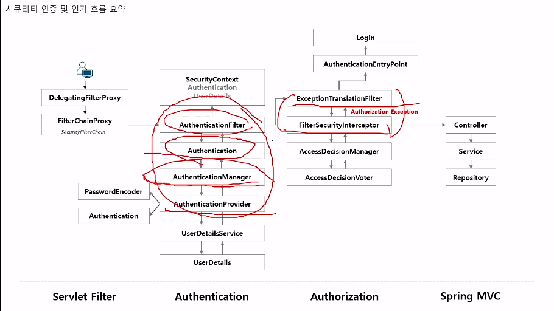

# OAuth2 Study

## 시큐리티 인증 및 인가 흐름 요약

1. AuthenticationFilter
2. Authentication (아이디, 패스워드)
3. AuthenticationManager
  * 아래에 위임
4. AuthenticationProvider
  * 아이디와 패스워드를 가지고 인증에 실패, 성공 여부 확인
5. UserDetailsService
6. UserDetails

## Basic 인증 

## OIDC 로그인 요청

* OpenID Provider
  * 줄여서 OP, OpenID 제공자로서 최종 사용자를 인증하고 인증 결과와 사용자에 대한 정보를 신뢰 당사자에게 제공할 수 있는 OAuth 2.0 서버를 의미한다.
* Relying Party
  * 줄여서 RP 라고 하며 신뢰 당사자로서 인증 요청을 처리하기 위해 OP 에 의존하는 OAuth2.0 애플리케이션을 의미한다.

### 흐름

1. RP 는 OP 에 권한 부여 요청
2. OP 는 최종 사용자를 인증하고 권한을 얻는다. 
3. OP 는 JD 토큰과 액세스 토큰으로 응답한다. 
4. RP 는 Access Token 을 사용하여 UserInfo 엔드포인트에 요청을 보낼 수 있다. 
5. UserInfo 엔드포인트는 최종 사용자에 대한 클레임을 반환한다.

### Implicit Grant Type 

* 이 경우는 access token 을 직접 url 을 통해서 전달되기 때문에 OIDC 에서는 nonce 매개변수를 포함해야 한다. 토큰 재생 공격 방지 출처 식별 사용, 해당 nonce 클레임에는 요청에서 전송된 것과 정확히 동일한 값이 포함되어야 한다. 아니면 거부한다.

## 권한 부여

### 권한 부여 유형

1. Authorization Code
  * 권한 코드 부여 타입, 서버 사이드 어플리케이션, 보안에 가장 안전한 유형

2. Implicit Grant Type (Deprecated)
  * 암시적 부여 타입, 공개 클라이언트 어플리케이션 (SPA 기반 js 앱, 모바일 앱) 보안에 취약

3. Resource Owner Password Crendentials Grant Type (Deprecated)
  * 리소스 사용자 비밀번호 자격증명 부여 타입, 서버 어플리케이션 보안에 취약

4. Client Credentials Grant Type
  * 클라이언트 자격 증명 권한 부여 타입, 

5. Refresh Token Grant Type

6. PKCE-enchanced Authroization Code Grant Type

### 권한 부여 흐름 선택 기준

* 클라이언트 공개 
  * 예 (front)
    * 클라이언트 SPA or 네이티브 앱? 
      * 네이티브
        * Authorization Code with PKCE
      * SPA
        * 브라우저가 PKCE 웹 암호화를 지원하는가?
          * 예 
            * Implicit Flow
          * 아니요
            * Authorization Code with PKCE
  * 아니요 (back)
    * 클라이언트가 최종 사용자를 가지고 있는가?
      * 예 
        * 클라이언트가 고도의 신뢰성을 가지고 있으며 다른 권한 부여 타입은 실행 가능하지 않는가?
          * 예
            * Authoriztion Code Flow
          * 아니요
            * Resource Owner Flow
      * 아니요
        * Client Credentials Flow